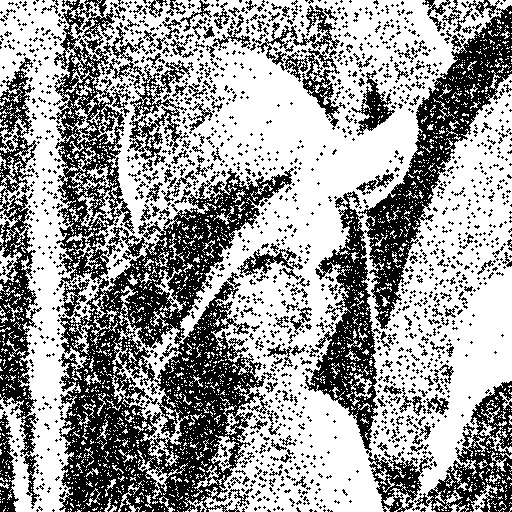

# Overview
This program uses the Metropolis algorithm to convert a photo into a pixel art.

# Get started
- pip install pipenv
- pipenv install
- pipenv run python metropolisdotpainting.py 

# iOS app promotion
I developed a iOS app that uses the Metropolis algorithm. This app uses the Metropolis algorithm to create generative art style paintings.
https://apps.apple.com/jp/app/photo2painting/id1581044523